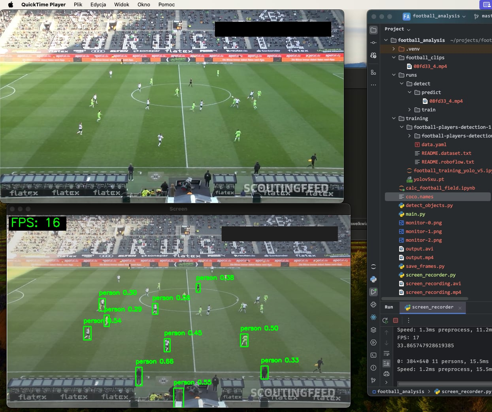

# Football Analyzer

## Introduction
Football Analyzer is a Python application designed for real-time analysis of football matches. The application can stream matches and detect players on the field using frames from the video stream. The current model is under training.

## Table of Contents
- [Introduction](#introduction)
- [Installation](#installation)
- [Usage](#usage)
- [Features](#features)
- [Dependencies](#dependencies)
- [Examples](#examples)
- [Contributors](#contributors)

## Installation
To install Football Analyzer, follow these steps:

1. Clone the repository:
    ```bash
    git clone https://github.com/kwiats/football-analyzer.git
    ```
2. Navigate to the project directory:
    ```bash
    cd football-analyzer
    ```
3. Install the required dependencies:
    ```bash
    pip install -r requirements.txt
    ```

## Usage
To start analyzing a football match, run the main script:
```bash
python main.py
```

## Features
- Real-time streaming and analysis of football matches
- Player detection on the field

## Dependencies
- Python 3.11
- YOLOv10
- PyTorch
- OpenCV
- Matplotlib

## Contributors

<a href="https://github.com/kwiats/football-analyzer/graphs/contributors">
  
</a>

## Examples

